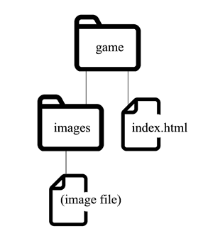

# Exercise: Links 

Even though, you're moving on to your "235 Home Page" assignment for Homework, let's spend a little more time with the "Dig Dug" page in class.

## Do the following:

1. Create the following file structure and put your **index.html** page in the top folder.  Put the image into the appropriate subfolder and preview.

    

1. Fix the link to the image so that it works.

1. Create a simple page that contains only a large image of the game (call the file **pic1.html**).  (ok if huge for now, but include alt text).  

1. Put it in a subfolder of **game** (maybe called "big").
(make sure the large image is still in the images folder).

1. Link from the **index.html** to the image page.

1. Link from the image page to the **index.html**.

1. Add an additional link (from the image page) to the source info area on the index page by adding a fragment name (you made one at the end of last exercise) to the URL of the index page. 

1. Make an external link to the page on MobyGames

1. Change that link so that it creates a new window when clicked.  (probably bad practice, but we still want you to see how it's done).

## If you get done early:

- Add a "thumbnail" of the screen shot to the index.html so that when it's clicked on, it goes to the big-view page.
- Add additional big images that represent the game.

### Navigation
[Return to Session 2-6](../sessions/2-6.md)

